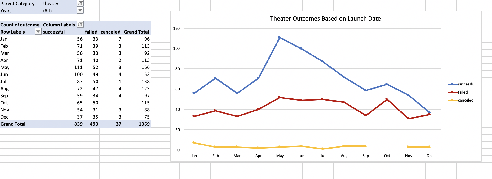
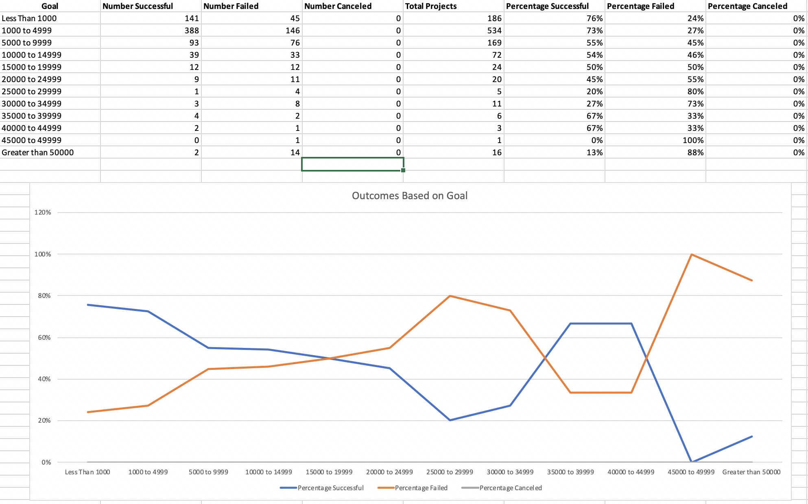

# Detailed Instructions From Your Instructor Team

The objective of this challenge is for you to practice using Excel functions covered in this module, apply a new function, `COUNTIFS()`, and practice creating visualizations.

Below are the key points to look out for as you work through each assignment.

## Deliverable 1: Outcomes Based on Launch Date

For the first deliverable, we are asking you to use Excel skills and knowledge of pivot tables and graphing to visualize campaigns that were successful, failed, and canceled based on launch date.

The pivot table should be filtered to include only "theater" campaigns from the kickstarter data and should resemble the screenshot below.

## Deliverable 2: Outcomes Based on Goals

For the second deliverable, we are asking you to use a new Excel function, `COUNTIFS()`, you may have not used in this module or in virtual class. For this deliverable you will filter the Kickstarter data set using the `COUNTIFS()` function to get the number of projects that were successful, failed, and canceled projects based on the goal amount. Then, they’ll graph the percentage of successful, failed, and canceled projects based on the goal amount.

**Note:** Using and applying new functions and methods in any programming language is a common practice. To guide you we will provide hints and links to examples as needed when asking you to use and apply a skill that were not covered in this module.

Once filtered to only include data for the "theater" category and "plays" subcategory in the `COUNTIFS()` function, the submission should resemble the screenshot below.

## Deliverable 3: Written Analysis of the Results

The goal of the writing assignment is for you to present you findings in a logical manner. You should use appropriate grammar and structure when writing. This is important because this is a future project for your portfolio of work to showcase in your repositories on LinkedIn or on your resume for employers.

For the written analysis, you should use the [README.md template](Written_Report_Template.md) to write the report. The report will contain three sections: an overview of the project, analysis and challenges encountered, and results.

**Overview of Project:** Explain the purpose of this analysis.

**Analysis and Challenges:** Provide details of how you performed your analysis, using images and links to code, as well as any challenges you encountered, and how you overcame them.

**Results:** Answer the following questions in complete and coherent sentences.

- What are two conclusions you can draw about the Theater Outcomes based on Launch Date?

- What can you conclude about the Outcomes based on Goals?

- What are some limitations of this dataset?

- What are some other possible tables and/or graphs that we could create?

The README.md document should be in the home directory of your github repository. All links should be working, and images should be formatted and displayed where appropriate.

## Grading Rubric

The [Kickstarter Grading Rubric](Module_1_Challenge_Grading_Rubric.pdf) is provided for you to use when grading the learners' submissions.
