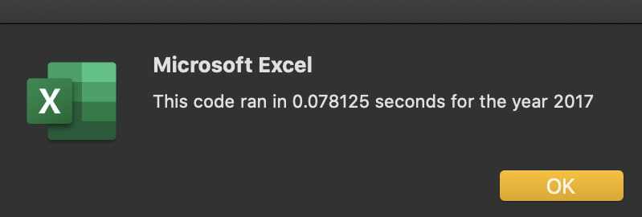
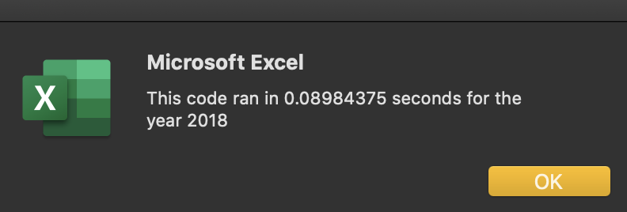

# Detailed Instructions From Your Instructor Team

The objective of this challenge is for you to refactor the VBA code by creating one `for` loop to loop through all the rows to get each ticker volume and the difference in starting and ending price, and then determine whether refactoring the original code successfully made the VBA script run faster.

## Deliverable 1: Refactor and Measure VBA Code Performance

For the technical deliverable, we are asking you to refactor, or edit, the solution to the Module 2 VBA code to perform the same analysis of the stocks, however, this time they will creat one `for` loop to loop through all the rows in order to improve efficiency of the code. Reworking code is known as refactoring and is a key part of the coding process.

We have provided you with a [VBA Challenge starter code](challenge_starter_code.vbs) code that includes the solution from Module 2 and comments as to where to make the changes according to the instructions.

The elapsed time to run the stocks for 2017 and 2018 should be faster than the elapsed time in the VBA Module and should look similar to the following images below. Elapsed times may vary depending on computer performance.

## Deliverable 2: Written Analysis of Results

The goal of the writing assignment is for you to present your findings in a clear and concise logical manner. You should use appropriate grammar and structure when writing. This is important because many students like to showcase their repositories on LinkedIn or on their resume for employers.

For the written analysis, you should use the repository README.md to write your report. The report will contain three sections: an overview of the project, analysis, and results.

**Overview of Project:** Explain the purpose of this analysis.

**Analysis:** Using images and examples of your code, compare the stock performance between 2017 and 2018, and the execution times of the original script and the refactored script.

**Results:** In a summary statement address the following:

- What are the advantages or disadvantages of refactoring code?

- How do these pros and cons apply to refactoring the original VBA script?

The README.md document should be in the home directory of their repository. All links should be working, and images and code should be formatted and displayed appropriately.

## Grading Rubric

The [VBA Wall Street Grading Rubric](Module_2_Challenge_Grading_Rubric.pdf) is provided for you to use to understand how the grading team will assess your submission.
