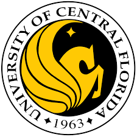

## Welcome to UCF-VIRT-DATA-PT-06-2022-U-B Class Repository

## Commonly Used Links:
* [Orientation Website](https://fsf.my.canva.site/orientation-b-tech)
* [Class Zoom Meeting Room](https://zoom.us/j/94441431030)
* [Class Github Repository](https://github.com/UCF-Coding-Boot-Camp/UCF-VIRT-DATA-PT-06-2022-U-B)
* [Class Slack Channel](https://join.slack.com/t/ucfvirtdatapt-5k29299/shared_invite/zt-18x461au8-wpCHz6vJkFNRGbZ1ugxa4Q)
* [Bootcampspot.com](https://courses.bootcampspot.com/)

## Teaching Team: 
* Jamie Miller - Instructor  
  - email - jmiller5@bootcampspot.com

## Course Student Success Manager (SSM):
* Chavon Rodriguez (SSM)
  - email: crodriguez@bootcampspot.com 
  - Calendly: https://calendly.com/crodriguez-21/15-min-chat-w-ssm-chavon

## Career Engagement Network:
[Career Engagement Nework](https://careernetwork.2u.com/?utm_medium=BCSMilestones&utm_source=boot_camp)